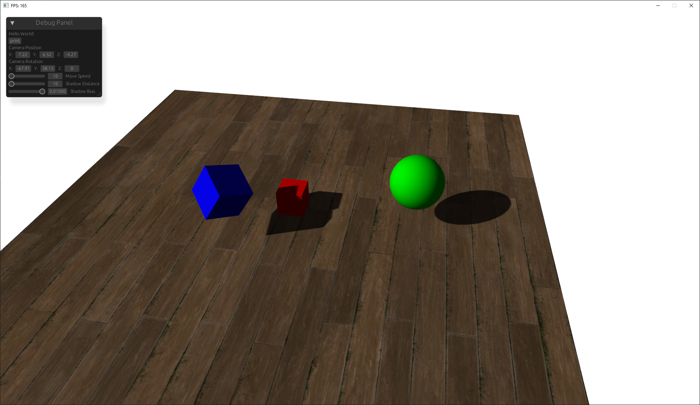
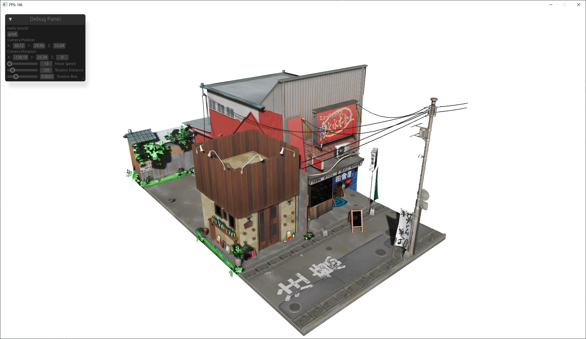

# Quaturn

A simple 3D Game Engine in Rust!

**Warning: This is still very very ...very work in progress**

## Features

**3D Model Support:** load and manipulate 3D GLTF models\
**Customizable:** write your own behavior functions for a Models and Cameras\
**Write Your Own Shaders:** write your own shaders with GLSL\
**Easily Add UI's:** using egui you can easily set up a UI

## Example Images



https://sketchfab.com/3d-models/japanese-restaurant-inakaya-97594e92c418491ab7f032ed2abbf596

## Getting Started

### Installation

1. Clone This Repo:

```bash
git clone https://github.com/ToothlessBrush/Quaturn.git
cd Quaturn
```

2. Running The Engine

```bash
cargo run
```

### Code Overview

-   Initialization

```rust
let mut engine = Engine::init("Title", WINDOW_WIDTH, WINDOW_HEIGHT);
```

-   Add a Model

```rust
engine
    .add_model("model_name", Model::new("res/path/to/model"))
    .rotate_euler_xyz(glm::Vec3::new(-90.0, 0.0, 0)) // here to translate Z+ up to Y+ up
    .scale(glm::vec3(0.1, 0.1, 0.1)) // scale models to your liking
    .define_ready(|model: &mut Model| {
        //runs when model is ready
        println!("(model_name) Is Ready!")
    })
    .define_ready(|model: &mut Model, context: &mut GameContext| {
        //runs every frame
        if input_manager.keys.contains(&Key::W) {
            //move mode forward when W is pressed
            model.translate(glm::vec3(0.0, 1.0 * fps_manager.time_delta.as_sec_f32(), 0.0));
        }
    })
```

-   Add a Camera

```rust
engine
        .add_camera(
            "camera",
            Camera3D::new(
                glm::vec3(10.0, 10.0, 10.0),
                glm::vec3(0.0, 0.0, 1.0),
                0.78539,
                WINDOW_WIDTH as f32 / WINDOW_HEIGHT as f32,
                0.1,
                1000.0,
            ),
        )
        .define_ready(|camera: &mut Camera3D| {
            //ran before the first frame
            println!("camera ready");
        })
        .define_behavior(|camera: &mut Camera3D, context: &mut GameContext| {
            //ran every frame
            //println!("camera behavior");
            camera.take_input(&context.input, context.frame.time_delta.as_secs_f32()); //basic built in fly movement
        });
```

-   Add a Shader

```rust
engine.context.nodes.add_shader(
        "default",
        Shader::new(
            "res/path/to/vertex/shader",
            "res/path/to/fragment/shader",
            "optional/path/to/geometry/shader",
        ),
    );
```

-   Add Lights with Shadows

```rust
engine.context.nodes.add_directional_light(
        "Direct Light",
        DirectionalLight::new(
            glm::vec3(1.0, 1.0, 1.0),
            glm::vec3(1.0, 1.0, 1.0),
            1.0,
            100.0,
            2048,
        ),
    );
```

-   Set Shader Uniforms

```rust
let shader = engine.context.nodes.add_shader(
        "default",
        Shader::new(
            "res/path/to/vertex/shader",
            "res/path/to/fragment/shader",
            "optional/path/to/geometry/shader",
        ),
    );
shader.set_uniform4f("lightColor", 1.0, 1.0, 1.0, 1.0);
```

-   Optionally add a UI with Egui

```rust
let ui = UI::init(&mut engine.window);
engine
    .add_ui("debug_panel", ui)
    .define_ui(move |ctx, context| {
        //ui to be drawn every frame
        egui::Window::new("Debug Panel").show(ctx, |ui| {
            ui.label("Hello World!");
        });
    });
```

-   Finally Start the Render Loop

```rust
engine.begin()
```

## Shader Uniforms

for building your own shaders the engine applies these uniforms you can also define your own uniforms with

```rust
shader.set_uniform(name, value)
```

| Uniform Name             | Type        | Description                                                    |
| ------------------------ | ----------- | -------------------------------------------------------------- |
| `diffuse0`               | `sampler2D` | Diffuse texture sampler                                        |
| `specular0`              | `sampler2D` | Specular texture sampler                                       |
| `shadowMap`              | `sampler2D` | Shadow map texture sampler                                     |
| `baseColorFactor`        | `vec4`      | Base color factor for the material (RGBA)                      |
| `useTexture`             | `bool`      | Whether to use the texture for the object                      |
| `useAlphaCutoff`         | `bool`      | Whether alpha cutoff is applied                                |
| `alphaCutoff`            | `float`     | Alpha cutoff value for transparency                            |
| `lightColor`             | `vec4`      | Color of the light (RGBA)                                      |
| `lightPos`               | `vec3`      | Position of the light source in world space                    |
| `camPos`                 | `vec3`      | Camera position in world space                                 |
| `u_farShadowPlane`       | `float`     | Far plane distance for shadow mapping                          |
| `u_directLightDirection` | `vec3`      | Direction of the directional light (normalized vector)         |
| `u_SpecularStrength`     | `float`     | Strength of the specular highlights                            |
| `u_AmbientStrength`      | `float`     | Strength of the ambient lighting                               |
| `u_bias`                 | `float`     | Bias value for shadow mapping to avoid shadow acne             |
| `u_BackgroundColor`      | `vec3`      | Background color of the scene (RGB)                            |
| `u_VP`                   | `mat4`      | View projection matrix (combined model-view-projection matrix) |
| `u_Model`                | `mat4`      | Model matrix for the object                                    |
| `u_lightSpaceMatrix`     | `mat4`      | Light space matrix for shadow mapping                          |

## Contributing

Contributions are welcome! If you have suggestions for improvements, feel free to create a pull request or open an issue.

## License

This project is licensed under the MIT License

## Acknowledgments

-   [nalgebra-glm](https://crates.io/crates/nalgebra-glm)
-   [egui](https://crates.io/crates/egui)
-   [glfw](https://crates.io/crates/glfw)
-   [gl](https://crates.io/crates/gl)
